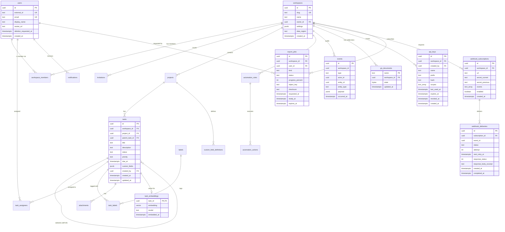
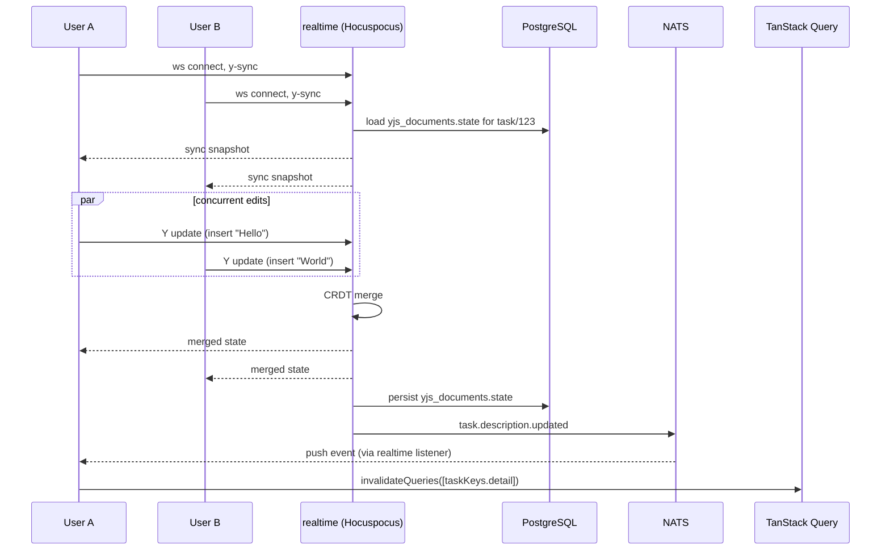
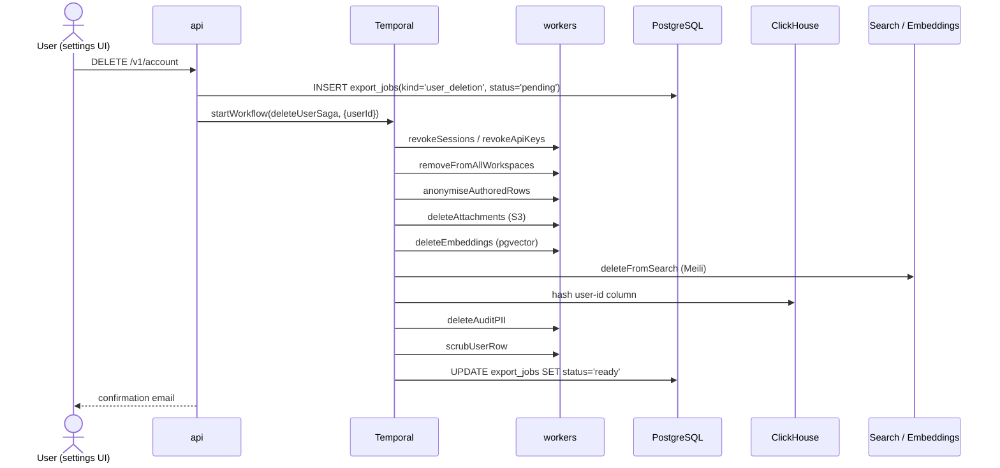

# Syncra — Architecture & Design Document

> A multi-tenant SaaS application for project & task management with **CRDT-based real-time collaboration**, a **Temporal-powered workflow engine**, semantic search, AI assist, deep audit trails, a **public REST API**, **outbound webhooks**, **scheduled workflows**, an **OLAP analytics pipeline** and **GDPR-grade export & deletion**.
>
> **Architecture style:** an **event-driven modular monolith with selective service extraction**. One business-logic service (`api`) owns all bounded contexts as internal NestJS modules; two satellite services (`realtime`, `workers`) exist where scaling profiles genuinely diverge. One PostgreSQL cluster with `workspace_id` + Row-Level Security for multi-tenant isolation. NATS JetStream for async integration; Temporal for durable workflows. Extraction of a module into its own service is explicitly **deferred** until an extraction-seam criterion is met (§3.4). This is documented formally in §25 (ADR 0010).
>
> **Why this framing matters:** the design exercises every important *distributed-systems* pattern — outbox, CQRS-lite, saga, event-driven integration, durable workflows, projections, idempotency, **circuit breakers, bulkheads, SLOs** — without paying the operational tax of 10+ services up front. The industry has walked back from the 2019–2022 microservices-everywhere era: Shopify, Segment, Amazon Prime Video, InVision and DAZN have all published retrospectives on consolidating back to monoliths or modular monoliths. The default in 2026 is **modular monolith + selective extraction**.
>
> **Positioning:** the backend-heavy, architecturally rich alternative to Notion + Monday.com. Payment / billing is intentionally out of scope.

---

## 1. Goals

### 1.1 Product goals

Workspace-scoped SaaS where teams can:

1. Create workspaces, invite members, assign roles (owner / admin / member / viewer).
2. Manage projects and tasks with user-defined custom fields.
3. **Collaborate in real time** on shared documents and boards via CRDTs — no lost writes, offline-safe, clean merges.
4. Automate work with **durable "When X → do Y" workflows** that survive crashes and retries.
5. **Search** tasks instantly (full-text + filters) and **semantically** ("find tasks similar to this bug report").
6. Get a full, tamper-evident audit trail.
7. Receive in-app and email notifications.
8. Attach files backed by S3-compatible storage.
9. **AI assist**: summarise a project, draft tasks, surface related work.
10. **Integrate via a public API** with API keys and fine-grained scopes.
11. **Subscribe to outbound webhooks** signed with HMAC so external systems can react to changes.
12. **Schedule recurring work** (daily digests, stale-task reminders, weekly reports) with cron-as-code.
13. **Analyse usage** via a dedicated OLAP store with dashboards modelled in dbt.
14. **Export their data** at any time and **be forgotten** on request — GDPR-style.

### 1.2 Learning goals

| You will learn                              | By building                                                         |
| ------------------------------------------- | ------------------------------------------------------------------- |
| Modular monolith with clean bounded contexts | 3 services, clear module seams inside each                          |
| Event-driven architecture + CQRS-lite        | All mutations emit events; projections for search, audit, AI, OLAP  |
| **Transactional outbox pattern**             | Zero-lost-events guarantee from DB to NATS                          |
| **CRDT-based collaboration**                 | Yjs docs persisted via Hocuspocus, awareness-based presence         |
| **Durable workflow orchestration**           | Temporal workflows as the automation runtime                        |
| Multi-tenancy & isolation                    | `workspace_id` + PostgreSQL Row-Level Security on every row         |
| **Vector search & AI**                       | pgvector + embeddings worker + RAG-style summarisation              |
| Data growth                                  | Partitioned audit table, read replicas, PgBouncer pooling           |
| **Public API design**                        | Versioning, API keys with scopes, per-key rate limits, rotation     |
| **Outbound webhook systems**                 | HMAC signing, exponential retries, delivery logs, secret rotation   |
| **Scheduled durable work**                   | Temporal Schedules with overlap/backfill policies                   |
| **OLTP vs OLAP separation**                  | ClickHouse + dbt; NATS-fed CDC pipeline                             |
| **Compliance workflows**                     | Long-running export jobs + right-to-be-forgotten as a Temporal saga  |
| **Production-grade frontend**                | TanStack Router/Query, Zustand, shadcn/ui, Yjs, OTel, Sentry, PWA   |
| **Modern operations**                        | Expand-migrate-contract, canary deploys, blue-green, SOPS-encrypted secrets |
| Observability you can debug with             | OpenTelemetry → Tempo/Loki/Prometheus + Sentry                      |
| **Resilience under failure**                 | Circuit breakers, bulkheads, timeouts, graceful degradation, backpressure, DLQs |
| **SLO-driven operations**                    | Per-surface SLOs, multi-window burn-rate alerts, error-budget policy |
| **When (not) to extract a service**          | Start with a modular monolith; extract only when a seam criterion is met |

### 1.3 How decisions are recorded — ADRs

Every non-trivial architectural choice (ORM, event bus, routing library, …) lives in `docs/adr/` as a numbered Markdown file using the **MADR 4** template:

```
docs/adr/
├── 0001-modular-monolith-vs-microservices.md
├── 0002-drizzle-over-prisma-and-typeorm.md
├── 0003-nats-jetstream-over-kafka.md
├── 0004-temporal-for-durable-workflows.md
├── 0005-yjs-crdt-for-collaboration.md
├── 0006-tanstack-router-over-react-router.md
├── ...
```

Each ADR states context, options considered, decision, and consequences. They are the project's audit trail of *why*, which the code can never capture.

---

## 2. Backend Tech Stack

| Concern                  | Choice                                                           | Why                                                                          |
| ------------------------ | ---------------------------------------------------------------- | ---------------------------------------------------------------------------- |
| Language / runtime       | TypeScript on Node.js 22 LTS                                     | One language end-to-end; shared Zod schemas across server & client           |
| Framework                | **NestJS 11** (modular monolith per service)                     | DI, decorators, first-class WebSocket / queue / microservice support         |
| Monorepo                 | **Nx 22** + npm workspaces                                       | Shared libs, affected-graph builds                                           |
| API style (edge)         | **tRPC** for the web frontend; **REST (`/v1/*`)** for public API & inbound webhooks | Type-safe internally; standard REST for third parties         |
| Public API auth          | **API keys** (`sk_live_...` prefix), Argon2id-hashed, scoped     | Industry convention; prefix enables leaked-key scanning                      |
| Webhook signing          | **HMAC-SHA256** with rotating dual secrets                       | Customers verify origin; rotation without downtime                           |
| Service-to-service auth  | **Short-lived internal JWTs** signed with a per-environment RSA key; `aud: "api"`, `iss: "workers"`, 5-minute TTL | Workers call back into api for Temporal activities without user context |
| Event bus                | **NATS JetStream**                                               | Simpler than Kafka; durable, at-least-once, subject-based routing            |
| Durable workflows        | **Temporal.io** (self-hosted locally, Temporal Cloud prod)       | Retries, timeouts, long-running orchestration; schedules first-class         |
| Background jobs (short)  | **BullMQ** (Redis-backed)                                        | Fast, lightweight for work that doesn't need Temporal's durability           |
| OLTP DB                  | **PostgreSQL 16** + **pgvector** + **pg_partman**                | JSONB, RLS, monthly partitioning, vector search                              |
| OLAP DB                  | **ClickHouse 24**                                                | Columnar, real-time analytics over billions of rows                          |
| Transform / modelling    | **dbt** (dbt-clickhouse)                                         | Declarative, tested, versioned analytics models                              |
| ORM / query layer        | **Drizzle ORM** with raw SQL migrations                          | Thin, TS-native, plays well with RLS / partitioning / vector                 |
| Migration tool           | **Drizzle Kit** + custom SQL for policies/partitions             | Drizzle Kit generates diffs; handwritten SQL for RLS, triggers, partitions   |
| Connection pooling       | **PgBouncer** in transaction mode                                | Protects Postgres from NestJS's short-lived connections                      |
| Cache                    | **Redis 7**                                                      | Hot-path reads + BullMQ + Yjs presence + rate limits                         |
| Search                   | **Meilisearch** with tenant tokens                               | Great DX; first-class multi-tenancy                                          |
| Real-time collaboration  | **Yjs** (CRDT) + **Hocuspocus** server + Postgres persistence    | Industry pattern used by Linear/Notion/Figma-style tools                     |
| Object storage           | **MinIO** locally, **S3** in prod                                | Dev/prod parity; hosts uploads + export bundles                              |
| Identity                 | **Auth.js v5** (self-hosted) **or** **Clerk** (hosted)           | Don't roll your own                                                          |
| Authorisation            | **Casbin** for RBAC policies                                     | Policy-as-data, testable, decoupled from code                                |
| Feature flags            | **OpenFeature SDK** + **Unleash** provider                       | Open standard, provider-swappable                                            |
| Error tracking           | **Sentry** (server SDK)                                          | Issue grouping, release tracking, source-map upload                          |
| Observability            | **OpenTelemetry** → Tempo (traces), Loki (logs), Prometheus      | Single instrumentation, multiple backends                                    |
| Secrets (dev)            | **Doppler** or **Infisical** (free tier)                         | `.env` files are the #1 secret-leak source; replace them                     |
| Secrets (prod, k8s)      | **SOPS** + **age** keys stored in cloud KMS                      | Git-ops-friendly; audit trail via commits                                    |
| Container orchestration  | Docker Compose (dev) / Kubernetes + Helm (prod-ish)              | Local parity, real deployment artifacts                                      |
| CI                       | GitHub Actions + `nx affected`                                   | Only rebuild/test what changed                                               |
| Testing                  | Vitest, Supertest, **Testcontainers**                            | Real PG/Redis/NATS/Meili/ClickHouse/Temporal per suite                       |

---

## 3. System Architecture

### 3.1 Context diagram — 3 services

```
                                ┌──────────────────────┐
                                │     Web Frontend     │
                                │ React 19 · Vite 6    │
                                │ TanStack Router/Query│
                                │ Tailwind 4 · Zustand │
                                │ tRPC client · Yjs    │
                                └──────┬────────┬──────┘
                   HTTPS+tRPC                │  │  WSS (Yjs)
                        ▼                    │  ▼
                  ┌────────────────┐         │  ┌──────────────────────┐
                  │  api (NestJS)  │         │  │ realtime (Hocuspocus)│
                  │ ─ tRPC (web)   │         │  │ ─ Yjs doc server     │
                  │ ─ REST /v1/*   │─API key─┘  │ ─ awareness/presence │
                  │   (public API) │            │ ─ y-postgres persist │
                  │ ─ /webhooks    │            └──────────┬───────────┘
                  │   (inbound)    │                       │ writes doc
                  │ ─ Modules:     │                       ▼
                  │   identity,    │             (Postgres yjs_documents)
                  │   workspace,   │
                  │   project,     │
                  │   automation,  │
                  │   search, ai,  │
                  │   api-keys,    │
                  │   webhooks-out,│
                  │   export, ...  │
                  └────────┬───────┘
                           │ publish via outbox
                           ▼
                  ┌───────────────────┐      ┌─────────────────────┐
                  │   NATS JetStream  │◄────►│ Temporal (workflows │
                  │    (event bus)    │      │  + Schedules)       │
                  └─────────┬─────────┘      └──────────┬──────────┘
                            │ subscribe                  │ activity
                            ▼                            ▼
                  ┌──────────────────────────────────────────┐
                  │         workers (NestJS standalone)      │
                  │  ─ audit consumer (→ events table)       │
                  │  ─ search indexer (→ Meilisearch)        │
                  │  ─ embeddings (→ pgvector)               │
                  │  ─ notification dispatch (email / push)  │
                  │  ─ Temporal workers:                     │
                  │      · automation actions                │
                  │      · webhook delivery                  │
                  │      · export jobs                       │
                  │      · GDPR deletion saga                │
                  │      · scheduled digest / cleanup        │
                  │  ─ analytics-cdc (→ ClickHouse)          │
                  │  ─ file post-processing (thumb / AV)     │
                  └──────────────────────────────────────────┘
                            │
                            ▼
            ┌───────────────────────────────────────────────────────┐
            │  Shared infrastructure                                │
            │  ┌────────────┐ ┌──────────┐ ┌──────────────┐        │
            │  │ PostgreSQL │ │  Redis   │ │  Meilisearch │        │
            │  │ PgBouncer  │ │ cache /  │ │ (per-ws tok) │        │
            │  │ + replicas │ │ BullMQ / │ └──────────────┘        │
            │  │ + pgvector │ │ RL       │                         │
            │  └────────────┘ └──────────┘                         │
            │  ┌────────────┐ ┌──────────────┐ ┌─────────────────┐│
            │  │  MinIO/S3  │ │   Unleash    │ │  ClickHouse +   ││
            │  │ (files +   │ │(feature flag)│ │   dbt (OLAP)    ││
            │  │  exports)  │ └──────────────┘ └─────────────────┘│
            │  └────────────┘                                      │
            └───────────────────────────────────────────────────────┘
```

### 3.2 Why only 3 services

Industry's loudest lesson of the last three years (Segment, Shopify, Uber, InVision post-mortems): **"we split too early"**. Microservices solve organisational and scaling problems, not architectural ones. With 3 services you still learn every distributed-systems pattern on the list:

- **api** — all HTTP/tRPC traffic + REST public API + inbound webhooks + business logic as internal modules.
- **realtime** — Hocuspocus server (long-lived WS, CRDT merges, different scaling profile).
- **workers** — everything triggered by events, Temporal workflows, Temporal Schedules, or CDC.

### 3.3 Bounded contexts inside `api`

| Module            | Owns                                                                 | Emits events                                                    |
| ----------------- | -------------------------------------------------------------------- | --------------------------------------------------------------- |
| `identity`        | Profile, memberships, role resolution (JWT verified via IdP JWKS)    | `user.registered`, `member.added`                               |
| `workspace`       | Workspaces, invitations, settings                                    | `workspace.created`, `workspace.invitation.*`                   |
| `project`         | Projects, tasks, subtasks, labels, custom field defs                 | `task.*`, `project.*`, `custom_field.*`                         |
| `automation`      | Rule definitions; starts Temporal workflows on matching events        | `automation.rule.*`, `automation.workflow.started`              |
| `search`          | Facade over Meilisearch; tenant-token issuance                       | —                                                               |
| `ai`              | Semantic search, summarisation endpoints (RAG)                        | `ai.query.executed`                                             |
| `notification`    | Read API for inbox; mark-as-read                                      | `notification.read`                                             |
| `file`            | Signed upload/download URLs, attachment metadata                      | `file.uploaded`                                                 |
| `api-keys`        | Key issuance, scopes, rotation, last-used tracking                    | `api_key.created`, `api_key.revoked`                            |
| `public-api`      | REST `/v1/*` surface consumed by API keys                             | — (delegates to domain modules)                                 |
| `webhooks-out`    | Subscription CRUD, HMAC signing, retry orchestration via Temporal     | `webhook.subscription.*`, `webhook.delivered`, `webhook.failed` |
| `webhooks-in`     | Inbound webhook receivers (e.g. email provider bounces)               | `webhook.inbound.received`                                      |
| `export`          | Export job lifecycle; right-to-be-forgotten requests                  | `export.requested`, `export.completed`, `user.deletion.requested` |
| `flags`           | OpenFeature evaluation, admin overrides                               | —                                                               |

### 3.4 Extraction seams

Extract a module only if: different scaling profile · different team/cadence · different runtime · blast-radius isolation · regulatory isolation. Otherwise **keep it a module**.

---

## 4. Communication Patterns

### 4.1 The three lanes

```
  Edge (web)  → tRPC  → ┌──────────────────────────┐
  Edge (3rd   → REST  → │       api (NestJS)       │
   party)      /v1      └─┬──────────────┬─────────┘
                          │ module call  │ publish via outbox
                          ▼              ▼
                ┌───────────────┐  ┌────────────────┐
                │ same-process  │  │ NATS JetStream │  ← durable, at-least-once
                │ module (DI)   │  └───────┬────────┘
                └───────────────┘          │
                                           ▼
                                  ┌────────────────┐
                                  │    workers     │  ← idempotent consumers
                                  └────────────────┘
```

### 4.2 Event taxonomy

Subjects: `<bounded-context>.<entity>.<past-tense-verb>`.

```
workspace.created / member.added / invitation.* / ...
task.created / updated / status_changed / assigned / deleted
file.uploaded
automation.rule.changed / workflow.started / workflow.completed
api_key.created / api_key.revoked
webhook.subscription.created / webhook.delivered / webhook.failed
export.requested / export.completed
user.deletion.requested / user.deletion.completed
notification.delivered
```

Envelope: `id`, `type`, `version`, `occurredAt`, `workspaceId`, `actorId`, `correlationId`, `causationId`, `payload` (Zod-validated).

### 4.3 Zod-first contracts

All event payloads and REST DTOs live in `libs/contracts` as Zod schemas. Additive-only evolution enforced in CI.

### 4.4 Transactional Outbox Pattern

```
BEGIN
  INSERT INTO tasks (...);
  INSERT INTO outbox (id, subject, payload);
COMMIT
    │
    ▼
 outbox relay → NATS.publish(msgId = event.id)  — dedupes at broker
    │
    ▼
 consumer: SELECT from processed_events; no-op if seen; else do work + INSERT
```

```sql
CREATE TABLE outbox (
  id uuid PRIMARY KEY, subject text NOT NULL, payload jsonb NOT NULL,
  created_at timestamptz NOT NULL DEFAULT now(), published_at timestamptz
);
CREATE INDEX outbox_unpublished ON outbox (created_at) WHERE published_at IS NULL;

CREATE TABLE processed_events (
  consumer text NOT NULL, event_id uuid NOT NULL,
  processed_at timestamptz NOT NULL DEFAULT now(),
  PRIMARY KEY (consumer, event_id)
);
```

---

## 5. Data Model

### 5.1 Multi-tenancy

Shared database, shared schema, `workspace_id` on every tenant-scoped row + PostgreSQL Row-Level Security.

```sql
ALTER TABLE tasks ENABLE ROW LEVEL SECURITY;
CREATE POLICY tasks_tenant_isolation ON tasks
  USING (workspace_id = current_setting('app.workspace_id')::uuid);
-- Per-request: SET LOCAL app.workspace_id = ...; SET LOCAL app.user_id = ...;
```

### 5.2 ER diagram



Remaining tables (`workspace_members`, `invitations`, `projects`, `custom_field_definitions`, `task_assignees`, `labels`, `task_labels`, `attachments`, `automation_rules`, `automation_actions`, `notifications`) are unchanged.

### 5.3 Custom fields, audit partitioning, hot cache, PgBouncer + replicas

Unchanged — JSONB field values on `tasks` with GIN index; `events` partitioned monthly via `pg_partman`; Redis cache invalidated by producers; PgBouncer in transaction mode; `db.write()` vs `db.read()` routing in Drizzle.

---

## 6. Real-Time Collaboration (CRDT-based)

Yjs + Hocuspocus + y-postgres. Awareness for presence. Redis adapter for horizontal scaling. Hocuspocus extension emits `task.description.updated` to NATS so audit, search, automation and analytics CDC all see edits.

---

## 7. Workflow Automation (Temporal)

Every `await` in a workflow is a durable checkpoint. Activities call the `api` via internal service-to-service JWTs so RLS, validation, audit paths fire uniformly. Temporal is also the runtime for **scheduled workflows (§10)**, **webhook deliveries (§9)**, and **export / GDPR deletion sagas (§12)**.

---

## 8. Public API + API Keys + Scopes

URL-versioned `/v1/*`. Keys are `sk_live_<prefix>_<secret>` — prefix stored plaintext + indexed for lookup, full key Argon2id-hashed. Scopes enforced per handler (`tasks:read`, `tasks:write`, `webhooks:manage`, …). Token-bucket rate limits per key in Redis. `Idempotency-Key` on every `POST`/`PATCH`, cached 24h. Sunset + Deprecation headers on older versions.

```sql
CREATE TABLE api_keys (
  id uuid PRIMARY KEY, workspace_id uuid NOT NULL, created_by uuid NOT NULL,
  name text NOT NULL, prefix text NOT NULL, hash text NOT NULL,
  scopes text[] NOT NULL, last_used_at timestamptz,
  expires_at timestamptz, revoked_at timestamptz,
  created_at timestamptz NOT NULL DEFAULT now()
);
CREATE INDEX api_keys_prefix ON api_keys (prefix);
```

---

## 9. Outbound Webhooks

SSRF-protected subscriptions (HTTPS only, no internal IPs). HMAC-SHA256 signing with dual secrets (`v1` current + `v0` previous) during rotation. Every delivery is a **Temporal workflow** with exponential backoff (30s → 30m → 12h, cap 24h or 9 attempts). Per-delivery row in `webhook_deliveries` powers a **customer-visible delivery log with replay**. Subscriptions auto-disable after 7 consecutive failure days.

---

## 10. Scheduled Workflows (Temporal Schedules)

Cron-as-code with **overlap policies** (`SKIP` default), **catchup window** for missed runs, **per-workflow time zones**, pause/backfill via UI. Schedules: daily digest, stale-task reminder, outbox GC, processed-events GC, audit partition pre-create, expired API keys cleanup, webhook at-risk detector, expired export bundles cleanup, weekly analytics roll-up.

---

## 11. Analytics Pipeline — OLTP → OLAP

```
outbox → NATS → analytics-cdc worker → ClickHouse raw_events (MergeTree)
                                                  │
                                                  ▼
                                       dbt models (staging / intermediate / marts)
                                                  │
                                                  ▼
                                       Metabase dashboards
```

Reuses the same NATS events the audit log consumes — no separate Debezium or WAL plumbing. ClickHouse schema `PARTITION BY toYYYYMM(occurred_at)`, `ORDER BY (workspace_id, event_type, occurred_at)`, TTL 2 years. dbt scheduled via Temporal.

---

## 12. Data Export & Right-to-be-Forgotten

Two kinds of export: `full_workspace` (admin) and `user_data` (user). Bundles written as streaming multipart uploads to S3 by a Temporal workflow, resumable, progress-reportable. 7-day signed URL, then auto-deleted.

GDPR deletion is a **Temporal saga**: revoke sessions/keys → remove from workspaces → anonymise authored rows (no cascade) → delete attachments → delete embeddings → delete from Meili → hash user-id in ClickHouse → scrub PII from audit payloads → scrub user row. Compensating steps for each. Legal-hold flag blocks deletion with a clear error.

---

## 13. Authentication & Authorisation

### 13.1 End-user identity

**Auth.js v5** (self-hosted) or **Clerk** (hosted). `users.external_id` points at the IdP subject. JWTs verified via upstream JWKS (keys cached, rotated). At login the frontend drops into a secure cookie (`Secure`, `HttpOnly`, `SameSite=Lax`, `__Host-` prefix); tRPC calls re-use it.

### 13.2 Authorisation

Casbin enforces user-based RBAC — every endpoint asserts `enforce(user, action, resource, workspaceId)`. API-key requests are gated by **scopes** (§8.3) *before* Casbin.

### 13.3 Service-to-service authentication

When workers (Temporal activities, CDC, etc.) call back into `api`, they present a **short-lived internal JWT**:

```
iss: "worker-<role>"       # e.g. "worker-automation"
aud: "api"
sub: "system:automation"
exp: now + 5 min
scope: ["automation:write", "notification:write"]
jti: <ulid>                 # idempotency + replay protection
```

Signed with an RSA private key held only by workers (mounted via SOPS in prod). `api` verifies against the public key and short-circuits RLS by setting `app.user_id = system-actor-for-workspace(ws)`. All system-actor writes still produce audit rows — they're just labelled `actor_id = <system-actor>`.

In prod the transport is further wrapped in **mTLS** at the ingress / service mesh layer (Linkerd or Istio) for belt-and-braces.

---

## 14. Feature Flags

OpenFeature SDK + Unleash provider. Eval context: `{ userId, workspaceId, role, plan, country }`. New flags introduced by v3: `public_api.v1.enabled`, `webhooks.signature_v1_only`, `analytics.metabase.enabled`, `export.full_workspace.enabled`. Safe default = OFF.

---

## 15. Frontend Architecture

The frontend is a **pure single-page app** (no SSR) talking to the `api` service via tRPC and to `realtime` via Yjs over WebSockets. Below is the full stack and the architectural reasoning.

### 15.1 Frontend tech stack

| Concern                   | Choice                                                 | Why                                                                    |
| ------------------------- | ------------------------------------------------------ | ---------------------------------------------------------------------- |
| Framework                 | **React 19**                                           | Compiler handles most memoisation; server-component-ready; actions API  |
| Build tool                | **Vite 6** + `@vitejs/plugin-react`                    | Fastest DX; ESM-first; production Rollup build                         |
| Language                  | TypeScript (strict, `noUncheckedIndexedAccess` on)     | No silent `undefined` in array/record access                           |
| Package manager           | **pnpm**                                               | Fastest install for monorepos; strict, no phantom deps; Nx-compatible  |
| Router                    | **TanStack Router**                                    | Type-safe routes + search-param schemas + loaders; pairs with Query    |
| Server state              | **TanStack Query v5**                                  | Cache, mutations, suspense, optimistic updates, offline persistence    |
| Offline mutation queue    | `@tanstack/query-persist-client` + broadcast channel   | Writes while offline queue locally and replay on reconnect             |
| RPC client                | **tRPC v11** (`@trpc/react-query`)                     | End-to-end type safety with zero codegen                               |
| Client state              | **Zustand**                                            | Tiny, DevTools-friendly; no Redux boilerplate                          |
| Realtime state            | **Yjs** + `@hocuspocus/provider` + Tiptap bindings     | CRDT collaboration, IndexedDB offline sync                             |
| Forms                     | **TanStack Form** (primary) or **React Hook Form**     | TanStack Form aligns with the rest of the TanStack stack; RHF is fine too |
| Validation                | **Zod** (shared from `libs/contracts`)                 | Single schema for API, forms, tests                                    |
| Styling                   | **Tailwind CSS v4** (CSS-first `@theme` config)        | OKLCH colours, faster engine, no config file                           |
| Component library         | **shadcn/ui** (copy-in) + **Radix UI** primitives      | Accessible, unstyled, composable; you own the code                     |
| Toasts / notifications    | **Sonner**                                             | Accessible, stacking, promise-aware; shadcn-ecosystem default          |
| Command palette (⌘K)      | **cmdk**                                               | Keyboard-first navigation + search every SaaS ships                     |
| Mobile sheets / drawers   | **vaul**                                               | Radix doesn't ship a bottom-sheet; vaul is the shadcn-ecosystem pick   |
| Keyboard shortcuts        | **react-hotkeys-hook**                                 | Global + scoped shortcuts with correct focus handling                  |
| Icons                     | **Lucide**                                             | Tree-shakeable, huge coverage                                          |
| Fonts                     | **Fontsource** + Inter (Variable)                      | Self-hosted, one `.woff2`, preloaded — no FOUT, no Google tracking     |
| Data grid                 | **TanStack Table v8**                                  | Headless; pair with our own styling                                    |
| Virtualisation            | **TanStack Virtual**                                   | Long task lists, large boards                                          |
| Rich text                 | **Tiptap 3** (ProseMirror) with Yjs collab extension   | Collab-first editor; schema-extensible                                 |
| Charts                    | **shadcn/ui charts** (Recharts) for dashboards; **Tremor** for admin analytics | Declarative, React-native, tokens-aware                |
| Drag-and-drop             | **dnd-kit**                                            | Modern, a11y-aware (keyboard DnD out of the box)                       |
| Animation                 | **Motion** (formerly Framer Motion)                    | Use only where motion aids comprehension; respect `prefers-reduced-motion` |
| Date/time                 | **date-fns v3** (primary) + **Temporal polyfill** where useful | Immutable; Temporal adopted progressively as runtime support lands |
| i18n                      | **Lingui v5** + ICU messages                           | TypeScript-native, macro-based, much smaller bundle than FormatJS       |
| Auth on client            | Auth.js React or Clerk SDK; session is a cookie only    | No localStorage tokens; frontend has no session state                  |
| Feature flags             | **OpenFeature React SDK** (Unleash backend)            | Open standard; evaluation context = user+workspace+plan; boot-hydrated |
| Product analytics         | **PostHog**                                            | Funnels, retention, flag experimentation; **required** for SaaS        |
| Error tracking            | **Sentry** (`@sentry/react`) with Session Replay       | Reproduce UX bugs; release tracking; source maps                       |
| Browser telemetry         | **OpenTelemetry JS** (web + fetch instrumentation)     | `traceparent` header flows into the server span — one trace end-to-end |
| Testing (unit)            | **Vitest** + **Testing Library**                       | Fast Vite-native runner, idiomatic React queries                       |
| Testing (component)       | **Storybook 9** + interaction tests + `@storybook/addon-a11y` | Component catalogue + dev-time a11y feedback                   |
| Mocking                   | **Mock Service Worker v2**                             | Network-level mocks for Storybook + component tests                    |
| Testing (E2E)             | **Playwright**                                         | Cross-browser, auto-wait, trace viewer, network stubs                  |
| A11y testing              | **axe-core** via `@axe-core/playwright`                | Regressions caught in CI, not in production                            |
| Visual regression         | **Chromatic** (hosted) or Playwright snapshots         | Catch unintended UI changes                                            |
| Linter / formatter        | **Biome** (primary); ESLint only for plugin coverage you can't get | 10–20× faster, one tool, zero-config                       |
| Bundle size governance    | **size-limit** with per-route budgets in CI            | A careless `import *` cannot double a bundle unnoticed                 |
| Perf budget               | **Lighthouse CI**                                      | LCP/TBT/CLS regression gate                                            |
| PWA                       | **Workbox** service worker + Yjs IndexedDB provider    | Offline-first collab edits + queued mutations                          |
| Bundle analysis           | `rollup-plugin-visualizer`                             | See what's shipping                                                    |
| Skeleton loaders          | Tailwind skeleton components in `shared/ui`             | Consistent perceived-performance across app                            |

### 15.2 Why a pure SPA (and not Next.js / React Server Components)

- The app is **entirely behind auth** — no SEO benefit from SSR.
- Most of the UI is **real-time collaborative state** living in Yjs client-side — RSC's server-first model fights this.
- tRPC already gives us end-to-end types without a meta-framework.
- Vite builds and dev-servers a pure SPA in a fraction of the time Next builds a mixed app.
- **Marketing/docs site**, if/when built, goes in a **separate Next.js app** (`apps/www`) — right tool for that job; wrong tool for the product.

ADR: `docs/adr/0007-spa-over-next-app-router.md`.

### 15.3 Routing (TanStack Router)

File-based routes under `apps/frontend/src/routes/`. Each route file exports a loader (typed), component, and search-param schema:

```
routes/
├── __root.tsx              # layout + <Outlet/>
├── _auth/                  # auth-only guard layout
│   └── login.tsx
├── _app/                   # authenticated layout
│   ├── index.tsx           # /  → workspace selector
│   ├── w.$workspaceId/
│   │   ├── index.tsx
│   │   ├── projects.tsx
│   │   ├── projects.$projectId.tsx
│   │   ├── projects.$projectId.tasks.$taskId.tsx
│   │   ├── automations.tsx
│   │   ├── api-keys.tsx
│   │   ├── webhooks.tsx
│   │   └── settings.tsx
│   └── account.tsx
└── 404.tsx
```

Type safety: `useParams()` is fully typed (no casts). `useSearch()` parses against a Zod schema — bad URLs surface immediately. **Loader prefetches run in parallel** with route code, so route transitions never "wait, then fetch".

Code-splitting is per-route by default; the vendor bundle is chunk-split (React, Radix, TanStack, Sentry are separate chunks for better cache hit rates across releases).

### 15.4 State management hierarchy

There are five kinds of state. Each has its home:

| Kind                          | Home                              | Example                                   |
| ----------------------------- | --------------------------------- | ----------------------------------------- |
| **Server state**              | TanStack Query                    | tasks list, project settings, user inbox  |
| **URL state**                 | TanStack Router search params     | board filters, selected view, pagination  |
| **Collaborative state**       | Yjs `Y.Doc` (`@hocuspocus/provider`) | Task description rich text, board ordering |
| **Form state**                | React Hook Form                   | Any `<form>`                              |
| **Global client state**       | Zustand (one store per feature, or a root store) | Sidebar collapsed state, theme, active workspace id, bootstrapped flags |
| **Local component state**     | `useState` / `useReducer`        | Modal open/closed, hover, local input     |

Golden rule: **derived state is never stored**. Use `useMemo` or selectors. If you find yourself syncing two stores, one of them is wrong.

**Boot-time flag hydration.** The app calls `/api/bootstrap` once on load and the response (user + memberships + flag snapshot + server time skew) hydrates the Zustand root store *before the router renders its first route*. This avoids the first-paint flash where flags "pop in" late and gated UI flickers on/off. OpenFeature then subscribes for runtime flag changes via SSE, updating the same store.

### 15.5 TanStack Query conventions

```ts
// feature-scoped key factories — never hand-write keys
export const taskKeys = {
  all: ['tasks'] as const,
  list: (wsId: string, filters?: TaskFilters) => [...taskKeys.all, 'list', wsId, filters] as const,
  detail: (wsId: string, taskId: string) => [...taskKeys.all, 'detail', wsId, taskId] as const,
};

// hooks colocated with feature
export function useTasks(wsId: string, filters?: TaskFilters) {
  return trpc.task.list.useQuery({ workspaceId: wsId, filters }, {
    staleTime: 30_000,
    queryKey: taskKeys.list(wsId, filters), // override for clarity
  });
}

// mutation with optimistic update
export function useUpdateTaskStatus(wsId: string) {
  const qc = useQueryClient();
  return trpc.task.updateStatus.useMutation({
    onMutate: async ({ taskId, status }) => {
      await qc.cancelQueries({ queryKey: taskKeys.detail(wsId, taskId) });
      const prev = qc.getQueryData(taskKeys.detail(wsId, taskId));
      qc.setQueryData(taskKeys.detail(wsId, taskId), (old: Task) => ({ ...old, status }));
      return { prev };
    },
    onError: (_e, { taskId }, ctx) => {
      if (ctx?.prev) qc.setQueryData(taskKeys.detail(wsId, taskId), ctx.prev);
    },
    onSettled: (_d, _e, { taskId }) => {
      qc.invalidateQueries({ queryKey: taskKeys.detail(wsId, taskId) });
      qc.invalidateQueries({ queryKey: taskKeys.list(wsId) });
    },
  });
}
```

**Event-driven invalidation** — the realtime service pushes `task.*` events to all connected clients of a workspace; a single top-level listener maps events to `queryClient.invalidateQueries(...)`:

```ts
realtime.on('task.updated', ({ workspaceId, taskId }) => {
  queryClient.invalidateQueries({ queryKey: taskKeys.detail(workspaceId, taskId) });
  queryClient.invalidateQueries({ queryKey: taskKeys.list(workspaceId) });
});
```

This pattern replaces manual refetch-after-mutation for every client in the workspace — you collaborate with coworkers without even trying.

### 15.6 Real-time UX (Yjs + awareness)

```
Task page mounts
   │
   ▼
useYDoc('task/' + taskId)         ← memoised provider
   │ connects to realtime service
   ▼
Tiptap editor bound to Y.XmlFragment('description')
   │
   ├─ awareness.setLocalStateField('cursor', { x, y, color })
   │   → other clients see live cursors
   │
   └─ on doc change:
       Hocuspocus persists to Postgres
       Hocuspocus extension emits task.description.updated on NATS
       → audit / search / analytics all see the edit
```

Connection states (`connecting`, `connected`, `disconnected`, `syncing`) drive a subtle status indicator at the top of collaborative surfaces. Offline edits queue in IndexedDB and reconcile on reconnect.

### 15.7 Folder structure — feature-based

```
apps/frontend/src/
├── app/                    # root providers, router, error boundary
│   ├── App.tsx
│   ├── Providers.tsx       # QueryClient, Router, Theme, I18n, OpenFeature, Sentry
│   └── ErrorBoundary.tsx
├── routes/                 # file-based routes (TanStack Router)
├── features/               # one directory per bounded concept
│   ├── auth/
│   │   ├── api/            # tRPC hooks
│   │   ├── components/
│   │   ├── hooks/
│   │   ├── schemas/        # Zod schemas (re-export from contracts when possible)
│   │   └── index.ts        # barrel (public API of the feature)
│   ├── workspace/
│   ├── project/
│   ├── task/
│   ├── automation/
│   ├── search/
│   ├── ai/
│   ├── notification/
│   ├── api-keys/
│   ├── webhooks/
│   ├── export/
│   └── flags/
├── shared/
│   ├── ui/                 # shadcn/ui primitives + design-system components
│   ├── lib/                # trpc client, queryClient, yjs client, sentry, flags
│   ├── hooks/              # generic hooks (useDebounce, useMediaQuery, ...)
│   ├── i18n/               # Lingui setup + locale message catalogs
│   └── styles/             # tailwind entry, reset, fonts
├── main.tsx
└── vite-env.d.ts
```

**Rules**
- `features/*` may import from `shared/*` but never from another feature's internals — only its `index.ts`. Enforced by `nx module-boundaries`.
- `shared/ui` is not a free-for-all — anything there is used by at least two features.
- Tests live next to code (`Task.test.tsx`, `Task.stories.tsx`).

### 15.8 Design system — shadcn/ui + Radix + Tailwind v4

- **Primitives** from Radix (Dialog, Popover, DropdownMenu, …) — accessibility solved.
- **Styled components** copied in from shadcn/ui and customised — no runtime dependency on a UI lib.
- **Tokens** declared in Tailwind v4's `@theme` block — one source of truth for colours, spacing, radii, shadows.
- **Dark mode** via `prefers-color-scheme` + a user override; scoped via `[data-theme="dark"]`.
- **Typography scale** with a modular ratio; consistent line-heights.
- **Motion**: `prefers-reduced-motion` respected; motion via Framer Motion only where it aids comprehension.

### 15.9 Forms

```tsx
const schema = TaskCreate; // re-exported from libs/contracts
type Values = z.infer<typeof schema>;

export function CreateTaskForm() {
  const form = useForm<Values>({ resolver: zodResolver(schema) });
  const createTask = trpc.task.create.useMutation();
  const onSubmit = form.handleSubmit((values) => createTask.mutate(values));
  return (/* Radix-based form fields with aria-invalid linked to errors */);
}
```

Single schema → backend validation + frontend validation + TypeScript types. No drift possible.

### 15.10 Accessibility

- WAI-ARIA baked in via Radix primitives.
- Focus management: traps in modals, focus restoration on close.
- Keyboard-first flows for every UI operation (DnD via `dnd-kit`, menus, lists, editor).
- Colour tokens hit WCAG AA contrast by construction.
- `axe-core` runs in Playwright E2E — zero violations gate CI.

### 15.11 Internationalisation

- **Lingui v5** with ICU messages. Macro-based extraction keeps the runtime tiny vs. FormatJS.
- Server-returned dates in ISO 8601; displayed via `Intl.DateTimeFormat` using the user's locale/timezone (stored in `users.locale`/`users.timezone`).
- Pluralisation + gender through ICU; extraction via `@lingui/cli`.
- **RTL** via `[dir]` attribute + Tailwind's logical-property utilities (`ms-`, `me-`, …).
- Locale bundles are code-split per language — you never ship 40 languages to every user.

### 15.12 Performance discipline

- **Route-level code splitting** by default.
- **Long lists virtualised** (TanStack Virtual).
- **Images**: ``, `srcSet` for DPR, S3-side thumbnail generation.
- **Memoisation**: `useMemo` / `useCallback` only where a profiler flags it — or to stabilise deps of effects.
- **Re-render tracing**: React DevTools Profiler in dev; `why-did-you-render` behind a flag.
- **Lighthouse CI** budget: LCP < 2.5s on 4G, TBT < 200ms, CLS < 0.1.
- **Font loading**: `font-display: swap`, self-hosted + preloaded.
- **React compiler** enabled (React 19) — frees us from most manual memo work.

### 15.13 Error handling & telemetry

- **Error boundary** at the route level (TanStack Router supports this per-route) — shows a friendly fallback, captures to Sentry.
- **TanStack Query**: `throwOnError` for suspense queries; `onError` toast for mutations.
- **Sentry**:
  - `Sentry.reactRouterV6BrowserTracingIntegration` (or TanStack equivalent) for page transitions.
  - **Session Replay** with PII masking (`maskAllText: true`, allowlist for public-content).
  - Release tagging via CI: `VITE_APP_RELEASE = ${git_sha}`; source maps uploaded.
- **OpenTelemetry web**: fetch + XHR instrumentation adds `traceparent`; server span links to browser span. One trace from click to ClickHouse insert.

### 15.14 Auth on the client

- **The frontend has no session state.** It only has the result of a `useMe()` TanStack Query. If that query succeeds you're signed in; if it returns 401 the router sends you to `/login`. That's the entire model.
- Session lives in an `__Host-`-prefixed cookie, `Secure; HttpOnly; SameSite=Lax`. JS cannot read it — **no localStorage for tokens, ever**.
- Auth.js client / Clerk React SDK handle sign-in redirects; after login, all tRPC calls re-use the cookie automatically.
- Refresh is transparent: the server issues a new cookie on near-expiry requests. There is no refresh-token flow in the SPA.
- Sign-out hits `POST /auth/sign-out` which clears the cookie server-side; the client calls `queryClient.clear()` and redirects.
- Consequence: a tab opened 2 hours later with a still-valid cookie "just works"; a revoked session fails on the next request, not on a client-side timer.

### 15.15 Security (browser side)

- **CSP** enforced at the CDN/Nginx layer:
  - `default-src 'none'`
  - `script-src 'self' 'nonce-<per-request>'`
  - `style-src 'self' 'unsafe-inline'` (Tailwind runtime-inlined styles; justified)
  - `connect-src 'self' https://api.syncra.io wss://rt.syncra.io https://o0.ingest.sentry.io`
  - `img-src 'self' data: https://cdn.syncra.io https://*.gravatar.com`
  - `frame-ancestors 'none'`
- **HSTS** `max-age=63072000; includeSubDomains; preload`.
- **CSRF**: tRPC mutations require `X-Syncra-CSRF: <token>`; token is issued as a separate cookie (double-submit pattern). State-changing REST `/v1/*` endpoints are API-key-authed and exempt.
- **Subresource integrity** on any third-party script (none by design in the product app).
- **Trusted Types** policy enabled to kill DOM-XSS classes at the source.

### 15.16 PWA / offline

- **Workbox** service worker: app-shell cached (stale-while-revalidate for `/`), API responses never cached (auth + freshness).
- **Collaborative state (Yjs)**: `y-indexeddb` provider + Hocuspocus sync. Offline edits queue locally; on reconnect the CRDT merges cleanly with the server.
- **Non-Yjs mutations** (create task, change status, set assignee): TanStack Query's `@tanstack/query-persist-client` persists the mutation cache to IndexedDB. Mutations marked `networkMode: 'offlineFirst'` queue locally; a `broadcast-channel` wakes all tabs on reconnect and replays pending mutations in order, dedupes by idempotency key, and rolls back ones the server rejects.
- **Offline banner UI** with a pending-change counter; clicking it shows the queue with retry/discard per item.
- **Install prompt** behind a feature flag so you can stage the rollout.
- Service-worker updates use a non-blocking "Reload to update" toast (Sonner) instead of force-reloading mid-task.

### 15.17 Testing strategy

```
┌─────────────────── pyramid ────────────────────┐
│  E2E (Playwright)           ~30 flows          │  slow, high-signal
│  Component (Storybook play / RTL)  ~hundreds   │  medium
│  Unit (Vitest)              ~thousands         │  fast, many
└─────────────────────────────────────────────────┘
```

- **Unit**: pure logic, hooks (with `renderHook`), Zod schemas.
- **Component**: interactive behaviours — rendered state, a11y, keyboard paths. Storybook is both docs and a test host.
- **E2E**: golden paths per feature — create-workspace→invite→create-task→complete; realtime two-browser test; API-key issuance + first `curl`.
- **Fixtures**: `msw` at the network layer for component tests; Playwright's test context with a real signed-in session for E2E.
- **Visual regression**: Chromatic on PRs; budget for "intentional changes" marked by a commit trailer.
- **a11y**: `axe-playwright` on every E2E page; zero serious violations gates merge.

### 15.18 Build & deploy

- Vite production build → `dist/` with content-hashed asset filenames.
- `index.html` deployed separately (short cache, `Cache-Control: no-cache`); hashed assets `Cache-Control: public, max-age=31536000, immutable`.
- **CDN**: Cloudflare / CloudFront. Brotli + gzip. HTTP/3.
- **Preview deploys** per PR (Cloudflare Pages or Netlify) against a staging `api` + staging DB.
- **Feature flags** drive rollouts — no branch-per-experiment.
- **CSP nonce** injected at the edge; `index.html` served through a tiny edge function that stamps a nonce and rewrites `<script nonce="__NONCE__">`.

### 15.19 Developer experience

- `.vscode/` committed (recommended extensions, settings).
- **Biome** is the primary linter + formatter (10–20× faster than ESLint+Prettier, one tool instead of two). ESLint is kept only for the handful of rules Biome hasn't yet covered, if any.
- Pre-commit via **lefthook** (or **lint-staged + husky**); `nx format:check` runs in CI.
- **Bundle size budgets** enforced in CI via **size-limit** — per-route and per-vendor-chunk caps. A PR that blows the budget is blocked until justified or fixed.
- `@syncra/contracts` is the first thing rebuilt on any backend change — pulling stale types into the client is impossible.
- Storybook mocks tRPC at the provider level (via MSW v2) so components are authorable without a backend running.
- `docs/adr/0008-frontend-stack.md` explains the stack choices so future contributors don't relitigate them.

---

## 16. Key Flows (sequence diagrams)

### 16.1 Public API: create task via API key

```mermaid
sequenceDiagram
    participant C as Customer service
    participant A as api (/v1 handler)
    participant RL as Redis (rate limit)
    participant K as api-keys module
    participant P as project module
    participant DB as PostgreSQL
    participant N as NATS (outbox)
    participant W as workers

    C->>A: POST /v1/tasks (Authorization: Bearer sk_live_...)
    A->>K: lookup by prefix; Argon2 verify
    K-->>A: ApiKeyPrincipal{workspaceId, scopes, keyId}
    A->>A: require scope 'tasks:write'
    A->>RL: INCR rl:{keyId}:{bucket}
    RL-->>A: remaining=42
    A->>P: createTask(dto)
    P->>DB: BEGIN; INSERT tasks; INSERT outbox; COMMIT
    P-->>A: Task
    A-->>C: 201 Created (X-RateLimit-Remaining: 42)
    Note over N,W: outbox relay → NATS → workers (audit, search, embeddings, analytics-cdc, webhooks-out, ...)
```

### 16.2 Outbound webhook delivery with retries

```mermaid
sequenceDiagram
    participant N as NATS
    participant WO as webhooks-out consumer
    participant T as Temporal
    participant W as workers
    participant C as Customer endpoint
    participant DB as PostgreSQL

    N->>WO: task.created
    WO->>DB: SELECT subs WHERE enabled AND 'task.created' = ANY(events)
    loop per subscription
        WO->>T: startWorkflow(DeliverWebhook, {subId, eventId})
        T->>W: activity: attempt 1
        W->>DB: INSERT webhook_deliveries(attempt=1, status='pending')
        W->>C: POST url (HMAC sig)
        alt 2xx
            C-->>W: 200 OK
            W->>DB: UPDATE delivery status='success'
        else 5xx or timeout
            C-->>W: 500 / timeout
            W->>DB: UPDATE delivery status='failed', next_retry_at
            W-->>T: throw; Temporal schedules next attempt
            T->>W: attempt 2..N (backoff)
        end
    end
```

### 16.3 Frontend: collaborative edit



### 16.4 GDPR deletion saga



---

## 17. Monorepo Layout (Nx)

```
syncra/
├── apps/
│   ├── frontend/                 # (see §15.7 for internal layout)
│   ├── api/                      # NestJS HTTP service
│   │   └── src/modules/{identity,workspace,project,automation,search,ai,
│   │                    notification,file,api-keys,public-api,
│   │                    webhooks-out,webhooks-in,export,flags}
│   ├── realtime/                 # Hocuspocus + y-postgres + Redis adapter
│   └── workers/                  # NestJS standalone: NATS consumers + Temporal + BullMQ
├── libs/
│   ├── contracts/                # Zod event schemas + REST DTOs + tRPC routers (shared w/ FE)
│   ├── domain/                   # Pure domain types
│   ├── db-kit/                   # Drizzle schema, RLS helpers, read/write router
│   ├── event-bus/                # NATS client + outbox relay + idempotency
│   ├── auth-kit/                 # JWT verify, Casbin, API-key hashing/verify, internal S2S JWTs
│   ├── webhook-kit/              # HMAC signing + verification (also publishable to customers)
│   ├── rate-limit-kit/
│   ├── search-kit/
│   ├── ai-kit/
│   ├── flags-kit/
│   ├── analytics-kit/            # ClickHouse client, batch inserter
│   ├── export-kit/               # streaming zip + S3 multipart
│   ├── observability/            # OTel, logger, metrics, Sentry node
│   ├── ui-kit/                   # shadcn/ui + design tokens (frontend-only)
│   └── test-kit/                 # Testcontainers helpers
├── dbt/                          # dbt-clickhouse project
├── infra/
│   ├── docker/                   # Dockerfiles per service
│   ├── compose/                  # full local stack
│   ├── helm/                     # Helm charts per service
│   ├── temporal/                 # dev server + schedule bootstrap
│   ├── grafana/                  # provisioned dashboards
│   └── sops/                     # age keys + encrypted secrets per env
├── docs/
│   └── adr/                      # Architecture Decision Records
└── nx.json
```

**Golden rules**

- `libs/contracts` is the only place cross-service agreements live. Break-vs-additive enforced in CI.
- `webhook-kit` is structured so it can be published as `@syncra/webhooks` for customers.
- No app imports another app.
- `features/*` in the frontend can only import their own internals or `shared/*` or `libs/*`.

---

## 18. Deployment & Operations

### 18.1 Environments

| Env         | Purpose                                | Data                                       |
| ----------- | -------------------------------------- | ------------------------------------------ |
| local       | Developer machine, Docker Compose      | Seeded fixtures                            |
| preview/PR  | Ephemeral stack per open PR (optional) | Anonymised dump of staging                 |
| staging     | Continuous deploy from `main`          | Synthetic + invited internal users         |
| production  | Tagged releases                        | Real customer data                         |

### 18.2 Migrations — expand / migrate / contract

Zero-downtime schema changes follow three commits:

1. **Expand** — additive (add column nullable, add table, add index `CONCURRENTLY`). Safe to deploy while old code runs.
2. **Migrate** — backfill data; dual-write in code; read-new / write-both behind a flag.
3. **Contract** — drop old column / constraint, remove dual-write code.

Drizzle Kit handles most diffs; RLS policies, partitions, triggers are hand-written SQL in `db-kit/migrations/*.sql`. CI runs the full forward migration chain against a scratch DB on every PR.

### 18.3 Secrets

- **Dev**: Doppler or Infisical injects env vars at `npm run dev`. `.env` files stay empty / example-only.
- **Prod (Kubernetes)**: Secrets encrypted with **SOPS + age**, committed to git (`infra/sops/`), decrypted in-cluster by a sidecar with access to the age key stored in cloud KMS (AWS KMS / GCP KMS). Rotating a secret = edit + commit + redeploy.
- **Internal S2S JWT signing key**: rotated quarterly; old key kept for 24h so in-flight tokens still verify.

### 18.4 CI/CD

```
push → PR → GitHub Actions:
  ┌────────────────────────────────────────────────┐
  │ lint (Biome) · typecheck (nx affected)         │
  │ unit & component tests (nx affected)           │
  │ migration smoke test (scratch PG)              │
  │ contract schema diff (additive-only check)     │
  │ build (nx affected; docker images pushed)      │
  │ e2e Playwright against preview stack           │
  │ size-limit bundle budgets (frontend)           │
  │ Lighthouse CI (frontend)                       │
  │ axe-core a11y (frontend)                       │
  └────────────────────────────────────────────────┘
main → staging: automatic canary deploy (5% → 50% → 100% over 30 min; SLO-gated)
tag → prod: manual approval + same canary flow
```

### 18.5 Rollouts & rollback

- **Canary + progressive delivery** via Argo Rollouts (or Flagger). Auto-rollback if SLO (error rate, p95 latency) degrades.
- Every release is a tagged git SHA in the container image and in `VITE_APP_RELEASE` — Sentry clusters errors by release.
- Database migrations never rolled back — use a **forward fix** (v3 expand → contract).

### 18.6 Backups & DR

- **Postgres**: daily logical backup (`pg_dump`) + continuous WAL archiving to S3 → **PITR to any point in the last 7 days**. Monthly restore drill (restore into a scratch cluster, run a smoke SELECT).
- **ClickHouse**: native `BACKUP TABLE` to S3 nightly. Analytics is rebuildable from NATS retention anyway.
- **S3 buckets**: **object versioning** enabled; MFA-delete on prod.
- **RPO** 5 min (WAL), **RTO** ≤ 30 min (practised in drills).

### 18.7 Runbooks

One-page runbooks in `docs/runbooks/*.md` for: DB failover, NATS consumer lag spike, webhook storm, Temporal worker crashloop, Meilisearch reindex, emergency tenant export. Each links to its Grafana dashboard and alert definition.

---

## 19. Security Checklist

**Auth & authz**
- [ ] JWT verified via upstream IdP JWKS; signatures always validated.
- [ ] Cookies: `__Host-` prefix, `Secure`, `HttpOnly`, `SameSite=Lax`.
- [ ] CSRF token on every state-changing browser call (double-submit).
- [ ] RLS on every tenant-scoped table; CI test proves cross-tenant reads fail.
- [ ] Casbin policy check on every user-authed endpoint.
- [ ] Scope enforcement on every `/v1/*` endpoint.
- [ ] **Service-to-service JWTs** short-lived (≤5min), signed by a rotated RSA key.

**Keys, secrets, webhooks**
- [ ] API keys hashed with Argon2id; only prefix plaintext.
- [ ] Webhook URLs SSRF-filtered; HTTPS only.
- [ ] Webhook bodies HMAC-signed; dual-secret rotation supported.
- [ ] Webhook delivery log customer-visible with replay; auto-disable on sustained failure.
- [ ] Secrets in Doppler/SOPS; `.env` files gitignored.

**Data**
- [ ] Outbox pattern on every write that produces an event.
- [ ] Idempotent consumers with `processed_events` dedupe.
- [ ] pgvector queries always include `workspace_id = current_setting(...)`.
- [ ] Tenant-scoped Meilisearch tokens minted server-side only.
- [ ] S3 signed URLs with short TTL; Content-Type + size validated; AV scan on uploads.
- [ ] Export bundles signed URLs expire in 7 days, deleted on expiry.
- [ ] GDPR deletion saga anonymises rather than cascades; legal-hold flag can block it.
- [ ] ClickHouse user-id column hashed post-RTBF.

**Browser-side**
- [ ] Strict CSP with nonces; `frame-ancestors 'none'`.
- [ ] HSTS enabled (`preload`).
- [ ] No secrets in localStorage / sessionStorage.
- [ ] Trusted Types policy enforced.
- [ ] Sentry Session Replay masks all text / inputs by default.

**Ops**
- [ ] Feature flags default OFF; risky changes gated.
- [ ] Dependabot + Renovate on; `npm audit` in CI.
- [ ] Forward-only migrations; PR smoke-runs them.
- [ ] Least-privilege DB roles per service.

---

## 20. Observability

**OpenTelemetry** everywhere — browser, api, realtime, workers. Traces end-to-end via `traceparent` propagation. Emitted to the OTel Collector; fanned out to **Tempo** (traces), **Loki** (logs), **Prometheus** (metrics). **Grafana** is the single pane.

**Sentry** on the frontend (Session Replay for error reproduction) and backend (server-side issue grouping), clustered by release SHA.

**PostHog** for product analytics — funnels, retention, feature-flag experimentation and user session replay keyed to product journeys (complementary to Sentry's error-replay). PostHog and Sentry do not duplicate: Sentry replays *around errors*, PostHog replays *around user intent*.

New metrics this iteration:

- Webhook delivery success rate, attempt histogram per subscription.
- API-key RPS + scope error rate per key.
- CDC lag `now() - max(occurred_at)` in ClickHouse raw_events (alert > 5 min).
- Export job queue depth & duration.
- Temporal Schedule last-success timestamp per schedule.
- Yjs document load time p95 per workspace.

Structured logs include `workspace_id`, `user_id`, `trace_id`, `workflow_id`, `api_key_id`.

---

## 21. Resilience Patterns

Distributed systems fail in partial, weird ways. Observability tells you what broke; **resilience patterns decide what happens next**. Every pattern below is paired with a metric in §20 so you can see it working — or not working — in Grafana.

### 21.1 Timeout discipline

Every outbound call has an explicit timeout. Timeouts must **cascade** — the outer budget has to exceed every inner budget — otherwise a slow dependency drags the whole request down.

Default per-request budget for a tRPC mutation:

| Call                     | Timeout  | Rationale                                            |
| ------------------------ | -------- | ---------------------------------------------------- |
| Incoming tRPC request    | 10 s     | Absolute ceiling; the user has already tuned out     |
| PostgreSQL statement     | 2 s      | ~10× p99; kill and retry beats a hung connection     |
| PgBouncer checkout wait  | 500 ms   | If you can't get a pool slot fast, shed load         |
| Redis                    | 500 ms   | Cache miss is cheaper than a hung call               |
| NATS publish             | 3 s      | Publish is fast; anything slower is a broker problem |
| S3 / MinIO               | 30 s     | Large objects legitimately need time                 |
| Meilisearch              | 2 s      | If search is this slow, degrade to Postgres FTS      |
| LLM / embeddings API     | 60 s     | Streaming; apply chunked timeouts per chunk          |
| Webhook delivery (out)   | 15 s     | Customer endpoints must respond fast or fail         |

Enforced via a shared HTTP client in `libs/resilience/*` using `AbortController`. **No raw `fetch`** outside that lib — an ESLint rule forbids it.

### 21.2 Circuit breakers

Every outbound dependency is wrapped in a circuit breaker (`opossum`). Configuration:

- **Failure threshold**: 50% error rate over the last 20 requests or 30 s.
- **Half-open test**: after 30 s one probe is allowed.
- **Isolation**: one breaker per downstream — Meili has its own, each webhook URL has its own, the LLM provider has its own.

When open, calls **fail fast with 503** — the user sees a quick error instead of a 60-second timeout, and the downstream gets breathing room to recover.

Exposed metrics:

```
breaker_state{dep}           = 0|1|2   # closed|open|half-open
breaker_trips_total{dep}
breaker_time_open_seconds{dep}
```

### 21.3 Bulkheads

A failure in one downstream must not starve another. Implemented via **separate connection/socket pools per destination**:

```
┌─ Node HTTP agents ──────────────────────────────────────┐
│   agent("webhook-<host>")       maxSockets: 50          │
│   agent("llm-openai")           maxSockets: 20          │
│   agent("s3")                   maxSockets: 40          │
│   agent("meilisearch")          maxSockets: 20          │
└─────────────────────────────────────────────────────────┘
```

Similarly:
- A dedicated Redis client for **BullMQ** (never used for cache).
- A dedicated PG pool for the **outbox relay** so `/v1/exports` cannot starve outbox publishing.
- A dedicated PG role for **workers** so the API role cannot accidentally run background jobs.

### 21.4 Graceful degradation matrix

| If this is down | Degrade to                                                    | User-visible effect            |
| --------------- | ------------------------------------------------------------- | ------------------------------ |
| Meilisearch     | Postgres FTS (`tsvector` fallback behind `search.meili.enabled`) | Slower search, correct result  |
| LLM provider    | Hide AI buttons via `ai.summarize.enabled`                    | AI panel gone; app still works |
| Embeddings API  | Semantic search returns lexical results                       | "Related tasks" fewer/missing  |
| Redis cache     | Read-through to Postgres                                      | Slower, still correct          |
| NATS            | Writes still succeed; outbox backlog grows; alert on lag      | Real-time features lag         |
| Temporal        | Schedule-driven work pauses; request-path unaffected          | Digests + reminders delayed    |
| ClickHouse      | Analytics dashboards return "temporarily unavailable"         | OLTP unaffected                |
| Realtime svc    | Frontend falls back to TanStack Query polling (15 s)          | No live cursors; slight lag    |

Every one of these has a feature-flag kill-switch **and an automated test** that runs with the flag ON + dependency killed, asserting degradation still works.

### 21.5 Backpressure & load shedding

NATS consumer concurrency is capped per subject via JetStream `max_ack_pending`. If lag rises, we **shed non-critical work first**:

1. Pause **embeddings** consumer (semantic search degrades — acceptable).
2. Pause **analytics-cdc** consumer (dashboards go stale — acceptable).
3. Pause **search indexer** (search degrades — still less critical than audit).
4. **Never pause** the audit consumer — compliance. It has its own consumer group and priority.

HTTP tier: Nginx returns 429 with `Retry-After` when an internal queue exceeds threshold. Token-bucket per API key enforces fair use.

**Adaptive concurrency** (Netflix concurrency-limits pattern): instead of a fixed max concurrency, use a Vegas/Gradient2 limiter that raises the ceiling while latency is healthy and drops it as soon as latency degrades. Worker pools auto-tune to the slowest downstream without human intervention.

### 21.6 Retry budgets

Retries are useful until they aren't. A broken dependency plus unbounded retries equals a self-inflicted DDoS. Every retry policy sits inside a **global retry budget** per tier:

- **Tier-1 (customer HTTP → `api`)**: retries capped at 10% of traffic on a 60-second window. Exceeded → circuit opens immediately.
- **Tier-2 (workers → external APIs)**: Temporal workflows max 9 attempts + exponential backoff; BullMQ jobs max 5.
- **Webhook deliveries**: 9 attempts / 24 h cap regardless.
- **LLM calls**: 2 retries only on 429/503; never on 4xx.

### 21.7 Dead-letter queues & poison-message handling

Every NATS consumer has a DLQ subject `<source>.dlq`. A message goes to the DLQ when:

- 3 attempts failed with the same non-transient error within 1 minute, **or**
- the payload fails Zod parsing (schema drift), **or**
- the consumer explicitly calls `nak(terminal=true)`.

DLQ is monitored; `nats_consumer_dlq_pending > 0` pages on-call. An operator drains via a small CLI that replays or archives. Runbook: `docs/runbooks/dlq-drain.md`.

### 21.8 Sample implementation sketch

```ts
// libs/resilience/http-client.ts
import CircuitBreaker from 'opossum';

export function resilientCaller<T, Args extends unknown[]>(opts: {
  name: string;                 // 'llm-openai'
  timeoutMs: number;            // 60_000
  failureThresholdPct: number;  // 50
}) {
  return function wrap(fn: (...args: Args) => Promise<T>) {
    const breaker = new CircuitBreaker(
      async (...args: Args) =>
        withTimeout(fn(...args), opts.timeoutMs, `${opts.name} timed out`),
      {
        errorThresholdPercentage: opts.failureThresholdPct,
        resetTimeout: 30_000,
        rollingCountTimeout: 30_000,
        rollingCountBuckets: 10,
        name: opts.name,
      },
    );
    breaker.fallback(() => { throw new DependencyUnavailable(opts.name); });
    breaker.on('open',  () => metrics.breakerState.set({ dep: opts.name }, 1));
    breaker.on('close', () => metrics.breakerState.set({ dep: opts.name }, 0));
    return (...args: Args) => breaker.fire(...args) as Promise<T>;
  };
}
```

Every outbound call is routed through this wrapper. No exceptions.

---

## 22. SLOs & Error Budgets

Alerting on "something is broken" wakes on-call at 3 AM for things users never notice. **SLOs alert only when users are genuinely being hurt**.

### 22.1 Per-surface SLOs (28-day window)

| Surface                  | SLI                                                        | Target   |
| ------------------------ | ---------------------------------------------------------- | -------- |
| tRPC query               | p99 latency < 300 ms AND success ≥ 99.9%                   | 99.9%    |
| tRPC mutation            | p99 latency < 500 ms AND success ≥ 99.9%                   | 99.9%    |
| Public API `/v1/*`       | p99 latency < 1 s AND 5xx rate < 0.1%                      | 99.9%    |
| Realtime WS connect      | WS handshake success ≥ 99.5%                               | 99.5%    |
| Yjs doc first-sync       | p95 < 1 s                                                  | 99%      |
| Webhook delivery         | Successfully delivered within 24 h                         | 99.9%    |
| Search query             | p95 < 500 ms AND correctness per shadow-compare            | 99%      |
| Audit lag                | Event visible in `events` table within 10 s of source      | 99.5%    |
| Temporal schedule        | Workflow started within catchup window                     | 99.9%    |
| CDC freshness            | Event visible in ClickHouse within 5 min                   | 99%      |

Every SLO has a **module owner** (from `CODEOWNERS`) and a receiving alert channel. Orphan SLOs are rejected in CI.

### 22.2 Error budget

Budget = `(1 − SLO) × 28 days`. For 99.9%, that is **~40 minutes** of "being broken" per 28 days.

When the budget is exhausted:
- **Feature freeze** on the affected surface — a CI gate reads burn state and blocks non-hotfix PRs.
- **Mandatory post-incident review** before the next deploy to that surface.
- Page the module owner, not the whole team.

### 22.3 Multi-window, multi-burn-rate alerts

Following Google SRE Workbook chapter 5. Each SLO has two paired windows — **both** must be violated to alert, which kills false positives from brief blips while catching real regressions fast.

| Severity | Fast window         | Slow window          | Burn rate ≥ |
| -------- | ------------------- | -------------------- | ----------- |
| Page     | 2 % budget in 1 h   | 5 % budget in 5 min  | 14.4        |
| Ticket   | 10 % budget in 6 h  | 10 % budget in 30 min| 6           |

Prometheus rule sketch (tRPC mutation):

```promql
(
  sum(rate(trpc_requests_total{kind="mutation",status="error"}[1h]))
/ sum(rate(trpc_requests_total{kind="mutation"}[1h]))
) / (1 - 0.999) > 14.4
```

### 22.4 Instrumentation (what gets measured)

Every surface emits OTel + Prometheus:

- **tRPC**: histogram `trpc_request_duration_seconds{procedure,kind,status,workspace_id}` + counter `trpc_requests_total`.
- **Public API**: same, labelled by `route,method,status,api_key_id`.
- **NATS**: consumer lag gauge `nats_consumer_lag{subject,consumer}`.
- **Temporal**: workflow-complete counter with outcome label; `temporal_schedule_last_success_timestamp{schedule}`.
- **Webhooks**: success rate gauge per subscription; attempt histogram.
- **Realtime**: WS connection state gauge; awareness-message rate.
- **Yjs**: doc load p95 histogram per workspace.

### 22.5 Error-budget policy

Committed as `docs/slo-policy.md`:

- **Owners**: every SLO has one in `CODEOWNERS`.
- **Freeze semantics**: which CI checks enforce freeze; how hotfixes are waived.
- **Target revisions**: raise after two consecutive quarters green; lower only after two consecutive burnouts with a documented cause.
- **Escalation**: path when on-call burns >50% of the budget in a single incident.

### 22.6 SLOs, not SLAs

These are **internal targets**. Customer-facing SLAs (if you ever sign enterprise contracts) should be looser than internal SLOs so the team always has headroom. Never promise externally what you measure internally — keep one level of buffer.

---

## 23. Phased Roadmap

| Phase | Focus                                            | Est.          |
| ----- | ------------------------------------------------ | ------------- |
| 0     | Foundations (monorepo, compose, shared libs)     | 1 wk          |
| 1     | Identity + workspaces + RLS                      | 1 wk          |
| 2     | Projects + tasks + **outbox**                    | 1–2 wks       |
| 3     | Realtime (Yjs + Hocuspocus + awareness)          | 1–2 wks       |
| 4     | Search (Meilisearch) + AI (pgvector, RAG)        | 1–2 wks       |
| 5     | Temporal automation (rules + workflows + UI)     | 1–2 wks       |
| 6     | Notifications + files + flags                    | 1 wk          |
| 7     | Public API + API keys + scopes + idempotency     | 1 wk          |
| 8     | Outbound webhooks (+ delivery log + replay)      | 1–2 wks       |
| 9     | Temporal Schedules (digest, cleanup, …)          | 3–5 days      |
| 10    | Analytics pipeline (ClickHouse + dbt + Metabase) | 1–2 wks       |
| 11    | Data export + GDPR deletion saga                 | 1–2 wks       |
| 12    | Frontend hardening (PWA + offline mutation queue, i18n, a11y CI, Sentry, PostHog) | 1 wk |
| 13    | Ops hardening (canary, SOPS, runbooks, DR drill) | 1 wk          |
| 14    | Extract a service (if a seam is real)            | conditional   |

---

## 24. Distributed Systems Best-Practice Checklist

**Boundaries** · owns own data · integrates via `libs/contracts` · module boundaries enforced by Nx tags.
**Reliability** · outbox everywhere · idempotent consumers · Temporal for multi-step · DLQ with alerts · health checks real (not `return 200`).
**Resilience** · timeouts on every outbound call · circuit breakers per dependency · bulkheaded connection pools · graceful-degradation paths documented + tested · retry budgets enforced globally.
**Operability** · RED + saturation metrics · structured logs with trace/workspace/user ids · forward-only migrations · graceful shutdown · **SLOs per surface with multi-window burn-rate alerts**.
**Security** · RLS + Casbin + scopes · API-key hashing (Argon2id) · webhook signing/SSRF · short-lived S2S JWTs · CSP/HSTS · `__Host-` cookies + CSRF.
**Testing** · Zod contract tests · Testcontainers integration (PG+Redis+NATS+Meili+ClickHouse+Temporal) · Temporal time-skip tests · versioned `/v1/*` contract tests · E2E + a11y gates · **dependency-kill tests for each degradation path**.

---

## 25. ADR 0010 — Modular Monolith, Not Microservices

> Folded inline from `docs/adr/0010-modular-monolith-not-microservices.md`. Format follows **MADR 4**.

- **Status**: Accepted
- **Date**: 2026-04-19
- **Deciders**: Project owner
- **Tags**: architecture, services, deployment, learning-goals

### 25.1 Context

The initial goal for this project was framed as *"learn microservices"*. The v1 design proposed **8 separate services** (`api-gateway`, `auth`, `workspace`, `project`, `realtime`, `automation`, `audit`, `notification`, `file`) communicating over gRPC, each with its own database.

Architectural review surfaced four material problems with that framing:

1. **Industry reversal.** Public post-mortems (Segment *"Goodbye Microservices"*, Amazon Prime Video 2023, Shopify's *"Deconstructing the Monolith"*, InVision, DAZN) converge on the same lesson: splitting too early multiplied operational cost while delivering little of the promised agility.
2. **Single-team coordination tax.** With one developer/team, the per-service ceremony (CI pipelines, Helm charts, service contracts, deploy order, tracing plumbing) dwarfs the benefit.
3. **gRPC between TypeScript services is the wrong tool.** The type-safety tRPC + Zod already provides at zero ceremony is achieved by gRPC only after paying a proto-compile tax and losing fluent TS ergonomics. gRPC's value is cross-language; both ends here are TS.
4. **Database-per-service fights PostgreSQL RLS.** The primary multi-tenancy isolation mechanism is Row-Level Security on shared tables. Splitting each bounded context into its own database would multiply migration complexity, forbid cheap cross-context reads, and weaken — not strengthen — tenant isolation guarantees.

### 25.2 Decision

Adopt an **event-driven modular monolith with selective service extraction**:

- **One** business-logic service (`api`) containing all bounded contexts as NestJS modules (`identity`, `workspace`, `project`, `automation`, `search`, `ai`, `notification`, `file`, `api-keys`, `public-api`, `webhooks-out`, `webhooks-in`, `export`, `flags`).
- **Two** satellite services where scaling profiles genuinely diverge:
  - `realtime` — Hocuspocus server; long-lived WebSocket connections, memory-bound workload.
  - `workers` — NATS consumers, Temporal workers, BullMQ; restartable, horizontally scalable, not serving user traffic.
- **One** PostgreSQL cluster with `workspace_id` + Row-Level Security for isolation.
- **NATS JetStream** as the event bus; **Temporal** as the durable-workflow runtime.
- The **transactional outbox pattern** guarantees zero-lost-events from DB to NATS.

**Extraction-seam test** (§3.4): a module becomes its own service only when at least one of the following is true —

1. Different scaling profile (e.g. `ai` needs GPU nodes).
2. Different team / release cadence.
3. Different language / runtime.
4. Blast-radius isolation is required (e.g. webhook retries must not affect user traffic).
5. Regulatory / tenancy isolation is required.

If none apply, it stays a module.

### 25.3 Options considered

| Option                                                                                               | Verdict   | Rationale                                                                                              |
| ---------------------------------------------------------------------------------------------------- | --------- | ------------------------------------------------------------------------------------------------------ |
| **A.** Full microservices — 8–9 services, DB-per-service, gRPC                                       | Rejected  | Huge operational tax; fights RLS; learning project does not warrant the coordination overhead          |
| **B.** Single monolith — everything including realtime and workers in one process                    | Rejected  | WS connections and background work have fundamentally different lifecycles and scaling characteristics |
| **C.** Modular monolith + two satellite services (chosen)                                            | Accepted  | Balances learning outcomes, operational simplicity, and appropriate separation of concerns             |

### 25.4 Consequences

**Positive**
- All important distributed-systems patterns are exercised end-to-end: outbox, CQRS-lite, saga, event-driven integration, durable workflows, projections, idempotency, circuit breakers, bulkheads, SLOs.
- Multi-tenant isolation enforced at the database engine via RLS.
- One deploy pipeline for ~80% of changes; dramatically lower ceremony than microservices.
- Full type safety across all call sites via tRPC + Zod.
- Migrations apply once, not per-tenant and not per-service.
- New features land in the right module without renegotiating service contracts.
- Resilience patterns (§21) and SLOs (§22) give the operational maturity of a microservice system without the deployment complexity.

**Negative**
- The phrase *"I built microservices"* is not defensible on a résumé. The more accurate claim — *"event-driven modular monolith with selective service extraction"* — is longer to say but more credible to senior interviewers in 2026.
- A bug in one module can crash the entire `api` process. Partial mitigation: circuit breakers + bulkheads per outbound dependency; module boundaries enforced in CI via Nx tags.
- Future extraction of a module into its own service requires the codebase to respect module boundaries from day one. This is enforced in CI — no cross-module imports outside declared public barrels.

**Neutral**
- The `api` service is large by line count. This is a feature, not a bug, as long as the internal module boundaries are clean.

### 25.5 Revisit criteria

This decision is worth revisiting when any of these become true:

- More than one team owns the backend, with misaligned release cadences.
- Sustained SLO burn on a specific module's surface that module-internal changes cannot fix (e.g. `ai` latency forcing extraction to a GPU-node service).
- Regulatory requirement to physically isolate a tenant's data (drives extraction + region-specific deployment).
- A module genuinely needs a different runtime (e.g. `ai` → Python for HuggingFace tooling).

Until then, the extraction-seam test (§3.4) is the single gate. New modules default to *"inside `api`"*.

### 25.6 Related decisions

- ADR 0003 — NATS JetStream over Kafka
- ADR 0004 — Temporal for durable workflows
- ADR 0007 — SPA over Next.js App Router
- ADR 0009 — Monorepo over microfrontends

### 25.7 References

- Martin Fowler — *MonolithFirst* — https://martinfowler.com/bliki/MonolithFirst.html
- Segment — *Goodbye Microservices: From 100s of problem children to 1 superstar*
- Amazon Prime Video — *Scaling up the Prime Video audio/video monitoring service and reducing costs by 90%* (2023)
- Shopify Engineering — *Deconstructing the Monolith*
- Sam Newman — *Building Microservices*, 2nd ed. (argues the same position: start modular-monolithic, extract as needed)

---

## 26. References

- *Designing Data-Intensive Applications* — Martin Kleppmann
- *Release It!* — Michael Nygard
- MADR template — https://adr.github.io/madr/
- Transactional outbox — https://microservices.io/patterns/data/transactional-outbox.html
- Yjs — https://docs.yjs.dev/
- Hocuspocus — https://tiptap.dev/docs/hocuspocus/introduction
- Temporal TypeScript SDK — https://docs.temporal.io/develop/typescript
- Temporal Schedules — https://docs.temporal.io/schedule
- Meilisearch tenant tokens — https://www.meilisearch.com/docs/learn/security/tenant_tokens
- pgvector — https://github.com/pgvector/pgvector
- OpenFeature — https://openfeature.dev/
- Auth.js — https://authjs.dev/
- NATS JetStream — https://docs.nats.io/nats-concepts/jetstream
- PostgreSQL RLS — https://www.postgresql.org/docs/current/ddl-rowsecurity.html
- OpenTelemetry JS — https://opentelemetry.io/docs/languages/js/
- ClickHouse — https://clickhouse.com/docs
- dbt-clickhouse — https://docs.getdbt.com/docs/core/connect-data-platform/clickhouse-setup
- TanStack Router — https://tanstack.com/router
- TanStack Query — https://tanstack.com/query
- shadcn/ui — https://ui.shadcn.com/
- Radix UI — https://www.radix-ui.com/
- Tiptap — https://tiptap.dev/
- SOPS — https://github.com/getsops/sops
- Argo Rollouts — https://argo-rollouts.readthedocs.io/
- Stripe API design guide (gold standard even without payments) — https://stripe.com/docs/api
- GDPR right to erasure — https://gdpr-info.eu/art-17-gdpr/
- Argon2 — https://datatracker.ietf.org/doc/rfc9106/
